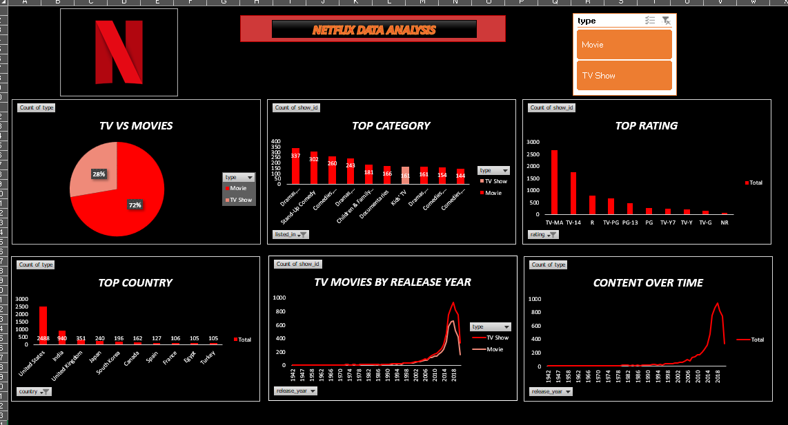

# Netflix_Data_Analysis

# Overview
This project involves analyzing Netflix data using Microsoft Excel to uncover trends, patterns, and insights about viewing habits, popular content, and platform usage. The dataset contains information such as titles, genres, release years, ratings, and more, which is processed and visualized through Excel's powerful data analysis tools.

# Objectives
1.Understand Content Trends: Analyze the most popular genres, release years, and regions for Netflix content.

2.Audience Preferences: Study viewing trends based on user ratings and other attributes.

3.Data Visualization: Create interactive charts and graphs to effectively communicate findings.

4.Key Metrics Analysis: Extract insights about content availability, average ratings, and growth trends.

# Features
1.Dataset cleaning and preparation using Excel.

2.Pivot tables and slicers for dynamic data exploration.

3.Trend analysis using line graphs, bar charts, and pie charts.

4.Conditional formatting to highlight key insights.

5.Summary dashboard for quick access to main findings.

# Tools and Techniques
1.Microsoft Excel: Used for data cleaning, analysis, and visualization.

2.Functions: Leverage functions like VLOOKUP, IF, COUNTIF, and more for data manipulation.

3.Pivot Tables: Create summarized views of the dataset for better insights.

4.Charts: Use Excel's charting tools to create compelling visualizations.

# Data Story :
Based on the analysis, the data reveals the following insights:

Movies are more popular than TV shows among Netflix users, with a higher share of viewership across all regions.

The Drama category consistently performs best across various regions, showcasing its universal appeal.

The United States emerges as the top country for Netflix usage, leading in both content consumption and user engagement.

# Dashboard

   &nbsp;

